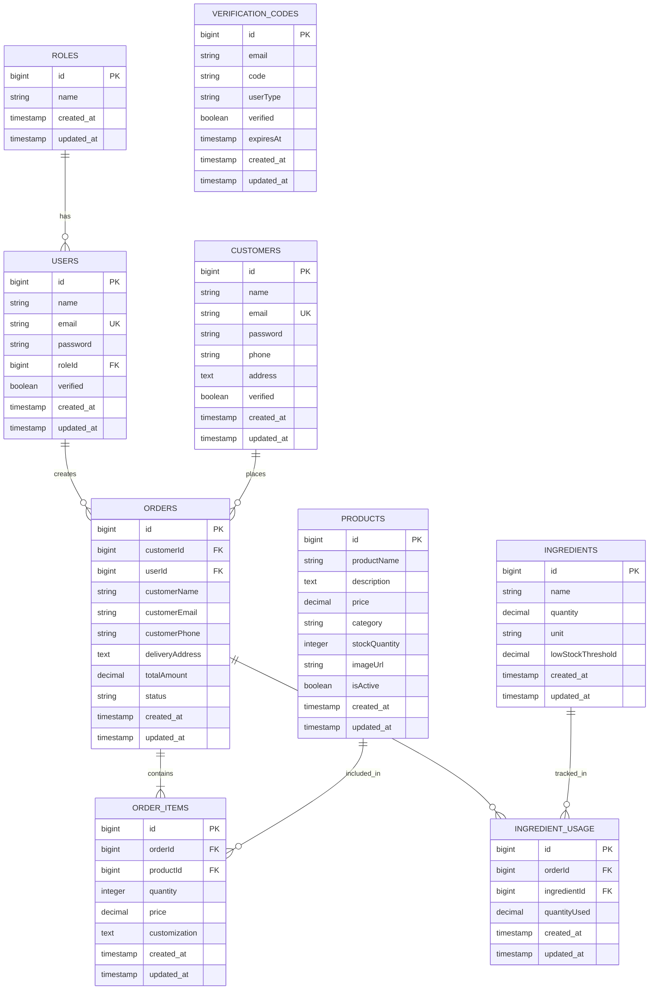

# 🍰 Sweet Crust - Bakery Management System

## Project Overview

**Sweet Crust** is a comprehensive bakery management system built with Laravel 9. It features dual authentication (staff and customer portals), product management, order tracking, inventory management, and email verification.

---

## 📊 Database Schema (ERD)

### Mermaid ERD Code



---

## 🏗️ System Architecture

### Technology Stack
- **Framework**: Laravel 9
- **Database**: MySQL
- **Frontend**: Blade Templates, Custom CSS, jQuery
- **Authentication**: Laravel Guards (Dual Auth)
- **Email**: Gmail SMTP
- **Icons**: Font Awesome 6.4.0
- **Tables**: jQuery DataTables

### Key Features
1. **Dual Authentication System** - Separate guards for staff and customers
2. **Email Verification** - 6-digit code with expiration
3. **Role-Based Access Control** - Admin, Baker, Staff roles
4. **Product Management** - Full CRUD with image upload
5. **Order Management** - Status tracking (Pending → In-Process → Completed → Delivered)
6. **Inventory Management** - Low stock alerts for ingredients
7. **Responsive Design** - Clean, minimalistic UI

---

## 📁 Project Structure

```
sweet-crust/
├── app/
│   ├── Http/
│   │   ├── Controllers/
│   │   │   ├── StaffAuthController.php
│   │   │   ├── CustomerAuthController.php
│   │   │   ├── DashboardController.php
│   │   │   ├── ProductController.php
│   │   │   ├── OrderController.php
│   │   │   ├── IngredientController.php
│   │   │   └── PublicController.php
│   │   └── Middleware/
│   │       ├── Authenticate.php
│   │       └── CheckRole.php
│   ├── Mail/
│   │   └── VerificationCodeMail.php
│   └── Models/
│       ├── Role.php
│       ├── User.php
│       ├── Customer.php
│       ├── VerificationCode.php
│       ├── Product.php
│       ├── Order.php
│       ├── OrderItem.php
│       ├── Ingredient.php
│       └── IngredientUsage.php
├── database/
│   ├── migrations/
│   │   ├── 2025_12_22_082402_create_roles_table.php
│   │   ├── 2025_12_22_082415_create_users_table.php
│   │   ├── 2025_12_22_082420_create_customers_table.php
│   │   ├── 2025_12_22_082459_create_verification_codes_table.php
│   │   ├── 2025_12_22_082504_create_products_table.php
│   │   ├── 2025_12_22_082509_create_orders_table.php
│   │   ├── 2025_12_22_082513_create_order_items_table.php
│   │   ├── 2025_12_22_082517_create_ingredients_table.php
│   │   └── 2025_12_22_082521_create_ingredient_usage_table.php
│   └── seeders/
│       └── DatabaseSeeder.php
├── resources/
│   └── views/
│       ├── staff/
│       │   ├── register.blade.php
│       │   ├── login.blade.php
│       │   ├── verify.blade.php
│       │   ├── set-password.blade.php
│       │   ├── dashboard.blade.php
│       │   ├── products/
│       │   ├── orders/
│       │   └── ingredients/
│       ├── customer/
│       │   ├── register.blade.php
│       │   ├── login.blade.php
│       │   ├── verify.blade.php
│       │   ├── set-password.blade.php
│       │   ├── dashboard.blade.php
│       │   ├── orders.blade.php
│       │   └── cart.blade.php
│       ├── public/
│       │   ├── home.blade.php
│       │   ├── products.blade.php
│       │   ├── product-details.blade.php
│       │   ├── about.blade.php
│       │   └── contact.blade.php
│       └── emails/
│           └── verification-code.blade.php
├── public/
│   ├── css/
│   │   └── style.css
│   └── images/
│       ├── products/
│       └── ingredients/
└── routes/
    └── web.php
```

---

## 🗄️ Database Models & Relationships

### 1. Role Model
- **Fields**: id, name, created_at, updated_at
- **Relationships**: hasMany(User)

### 2. User Model (Staff)
- **Fields**: id, name, email, password, roleId, verified, created_at, updated_at
- **Relationships**: 
  - belongsTo(Role)
  - hasMany(Order) as creator

### 3. Customer Model
- **Fields**: id, name, email, password, phone, address, verified, created_at, updated_at
- **Guard**: customer
- **Relationships**: hasMany(Order)

### 4. VerificationCode Model
- **Fields**: id, email, code, userType, verified, expiresAt, created_at, updated_at
- **Purpose**: Email verification for both staff and customers

### 5. Product Model
- **Fields**: id, productName, description, price, category, stockQuantity, imageUrl, isActive, created_at, updated_at
- **Relationships**: hasMany(OrderItem)

### 6. Order Model
- **Fields**: id, customerId, userId, customerName, customerEmail, customerPhone, deliveryAddress, totalAmount, status, created_at, updated_at
- **Relationships**:
  - belongsTo(Customer)
  - belongsTo(User) as creator
  - hasMany(OrderItem)
  - hasMany(IngredientUsage)

### 7. OrderItem Model
- **Fields**: id, orderId, productId, quantity, price, customization, created_at, updated_at
- **Relationships**:
  - belongsTo(Order)
  - belongsTo(Product)

### 8. Ingredient Model
- **Fields**: id, name, quantity, unit, lowStockThreshold, created_at, updated_at
- **Relationships**: hasMany(IngredientUsage)

### 9. IngredientUsage Model
- **Fields**: id, orderId, ingredientId, quantityUsed, created_at, updated_at
- **Relationships**:
  - belongsTo(Order)
  - belongsTo(Ingredient)

---

## 🔐 Authentication System

### Guards Configuration
```php
'guards' => [
    'web' => [
        'driver' => 'session',
        'provider' => 'users',
    ],
    'customer' => [
        'driver' => 'session',
        'provider' => 'customers',
    ],
],
```

### Authentication Flow
1. **Registration** → Email sent with 6-digit code
2. **Verification** → User enters code
3. **Set Password** → User creates password with strength validation
4. **Login** → Access to respective dashboard

---

## 🛣️ Routes Structure

### Public Routes
- `GET /` - Homepage
- `GET /products` - Products catalog
- `GET /products/{id}` - Product details
- `GET /about` - About page
- `GET /contact` - Contact page
- `POST /contact` - Submit contact form

### Staff Routes (`/staff/*`)
**Authentication:**
- `GET /staff/register` - Registration form
- `POST /staff/register` - Process registration
- `GET /staff/verify` - Verification form
- `POST /staff/verify` - Verify code
- `GET /staff/set-password` - Set password form
- `POST /staff/set-password` - Save password
- `GET /staff/login` - Login form
- `POST /staff/login` - Process login
- `POST /staff/logout` - Logout

**Dashboard & Management:**
- `GET /staff/dashboard` - Staff dashboard
- `GET /staff/products` - Products list
- `GET /staff/products/create` - Create product
- `POST /staff/products` - Store product
- `GET /staff/products/{id}/edit` - Edit product
- `PUT /staff/products/{id}` - Update product
- `DELETE /staff/products/{id}` - Delete product
- `GET /staff/orders` - Orders list
- `POST /staff/orders/{id}/status` - Update order status
- `GET /staff/ingredients` - Ingredients list
- `GET /staff/ingredients/create` - Create ingredient
- `POST /staff/ingredients` - Store ingredient
- `GET /staff/ingredients/{id}/edit` - Edit ingredient
- `PUT /staff/ingredients/{id}` - Update ingredient
- `DELETE /staff/ingredients/{id}` - Delete ingredient

### Customer Routes (`/customer/*`)
**Authentication:**
- `GET /customer/register` - Registration form
- `POST /customer/register` - Process registration
- `GET /customer/verify` - Verification form
- `POST /customer/verify` - Verify code
- `GET /customer/set-password` - Set password form
- `POST /customer/set-password` - Save password
- `GET /customer/login` - Login form
- `POST /customer/login` - Process login
- `POST /customer/logout` - Logout

**Dashboard & Orders:**
- `GET /customer/dashboard` - Customer dashboard
- `GET /customer/orders` - Order history
- `POST /customer/orders` - Place new order

---

## 🎨 Design System

### Color Palette
- **Primary**: #d4a574 (Gold)
- **Background**: #f8f9fa (Light Gray)
- **Text**: #333333 (Dark Gray)
- **Success**: #28a745 (Green)
- **Warning**: #ffc107 (Yellow)
- **Danger**: #dc3545 (Red)

### Typography
- **Font Family**: Segoe UI, Tahoma, Geneva, Verdana, sans-serif
- **Headings**: Bold, larger sizes
- **Body**: Regular weight, 14px base

### UI Components
- **Cards**: White background, subtle shadow
- **Buttons**: Rounded corners, smooth transitions
- **Forms**: Clean inputs with focus states
- **Tables**: jQuery DataTables with search, sort, pagination
- **Navigation**: Horizontal nav with icons

---

## 📧 Email Configuration

### Gmail SMTP Setup
1. Enable 2-Step Verification in Google Account
2. Generate App Password
3. Update `.env` file:
```env
MAIL_MAILER=smtp
MAIL_HOST=smtp.gmail.com
MAIL_PORT=587
MAIL_USERNAME=your-email@gmail.com
MAIL_PASSWORD=your-app-password
MAIL_ENCRYPTION=tls
MAIL_FROM_ADDRESS=your-email@gmail.com
MAIL_FROM_NAME="Sweet Crust Bakery"
```

---

## 🚀 Installation & Setup

### Prerequisites
- PHP 8.0+
- Composer
- MySQL
- XAMPP/WAMP/MAMP

### Installation Steps

1. **Clone/Download Project**
```bash
cd /Applications/XAMPP/xamppfiles/htdocs/sweet-crust
```

2. **Install Dependencies**
```bash
composer install
npm install
```

3. **Environment Configuration**
```bash
cp .env.example .env
php artisan key:generate
```

4. **Database Setup**
- Create database `sweet_crust_db`
- Update `.env` with database credentials
```env
DB_DATABASE=sweet_crust_db
DB_USERNAME=root
DB_PASSWORD=
```

5. **Run Migrations**
```bash
php artisan migrate
```

6. **Seed Database (Optional)**
```bash
php artisan db:seed
```

7. **Start Development Server**
```bash
php artisan serve
```

8. **Access Application**
- Public Site: http://localhost:8000
- Staff Portal: http://localhost:8000/staff/login
- Customer Portal: http://localhost:8000/customer/login

---

## 👥 User Roles

### 1. Admin
- Full system access
- Manage all products, orders, ingredients
- Manage staff users
- View all reports

### 2. Baker
- Manage products
- View and update orders
- Manage ingredients
- Track inventory

### 3. Staff
- View orders
- Update order status
- View products
- Limited access

### 4. Customer
- Browse products
- Place orders
- Track order history
- Manage profile

---

## 📊 Features Overview

### Staff Portal
✅ Dashboard with statistics (orders, products, customers, low stock)
✅ Product management (CRUD with image upload)
✅ Order management (view, update status)
✅ Inventory management (ingredients with low stock alerts)
✅ jQuery DataTables on all list pages
✅ Role-based access control

### Customer Portal
✅ Dashboard with order statistics
✅ Browse products catalog
✅ View product details
✅ Place orders
✅ Track order history
✅ Order status updates

### Public Website
✅ Homepage with featured products
✅ Products catalog with filters
✅ Product details page
✅ About us page
✅ Contact form

### Authentication
✅ Email verification with 6-digit code
✅ Password strength validation with live bullets
✅ Dual authentication guards
✅ Split login/signup design

---

## 🔒 Security Features

- CSRF Protection on all forms
- Password hashing with bcrypt
- Email verification required
- Role-based middleware
- SQL injection prevention (Eloquent ORM)
- XSS protection (Blade templating)
- Session management
- Secure password requirements

---

## 📝 Code Standards

### Naming Conventions
- **Controllers**: PascalCase with "Controller" suffix
- **Models**: PascalCase, singular
- **Variables**: camelCase
- **Database Tables**: snake_case, plural
- **Routes**: kebab-case

### Comments
- Roman Urdu/English bilingual comments
- Clear, descriptive comments for complex logic
- Function/method documentation

### File Organization
- Each file ≤ 50 lines (where possible)
- Standalone HTML (no @extends/@section in views)
- Minimal JavaScript (only for essential features)
- Custom CSS (no Bootstrap)

---

## 🧪 Testing

### Manual Testing Checklist
- [ ] Staff registration and login
- [ ] Customer registration and login
- [ ] Email verification flow
- [ ] Password strength validation
- [ ] Product CRUD operations
- [ ] Order placement and tracking
- [ ] Inventory management
- [ ] Low stock alerts
- [ ] Role-based access
- [ ] Public website navigation

---

## 📈 Future Enhancements

- Payment gateway integration
- Real-time order tracking
- Customer reviews and ratings
- Advanced reporting and analytics
- Mobile app (React Native/Flutter)
- Multi-language support
- Push notifications
- Loyalty program
- Recipe management
- Supplier management

---

## 🐛 Troubleshooting

### Common Issues

**1. Email not sending**
- Check Gmail SMTP settings
- Verify App Password is correct
- Ensure 2-Step Verification is enabled

**2. Database connection error**
- Verify database credentials in `.env`
- Ensure MySQL service is running
- Check database exists

**3. Images not uploading**
- Check `public/images/products` folder permissions
- Verify `php.ini` upload settings
- Check file size limits

**4. Session issues**
- Clear browser cache
- Run `php artisan cache:clear`
- Check session driver in `.env`

---

## 📞 Support & Contact

For issues, questions, or contributions:
- Email: support@sweetcrust.com
- Documentation: This file
- Login Credentials: See `LOGIN_CREDENTIALS.md`

---

## 📄 License

This project is proprietary software developed for Sweet Crust Bakery.

---

**Last Updated**: 22 December 2025  
**Version**: 1.0.0  
**Status**: Production Ready
